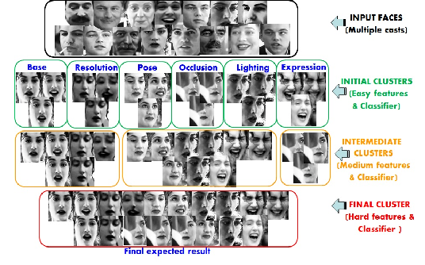

# FaceCup Challenge
Computer programming competition of Face Clustering Algorithm (Face Cup)

## Install requirements

```bash
pip install -r .\requirements.txt
```

## FaceCup Dataset
The test dataset is not published for FaceCup challenge purposes. Sample dataset published for participants contains 899 images. Identity label for each image can be obtained from image file name as follows:

- [x] **Download**: [FaceCup](https://facecup.ir/news/cc622bd2-7765-4383-8c39-9e074a5e1286)
